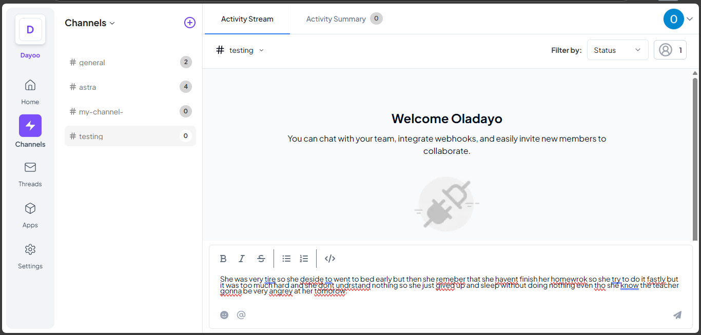
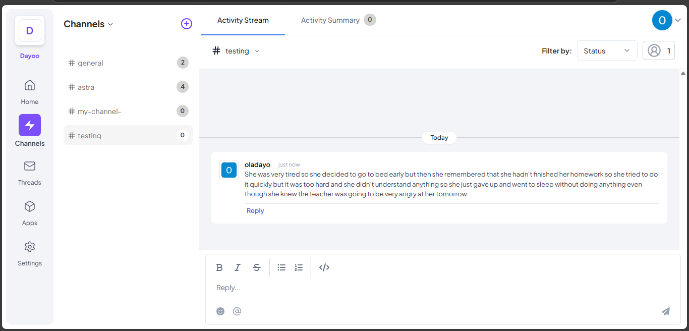

# **Telex Grammar Fixer**  
Telex Grammar Fixer is a modifier integration for the Telex platform that automatically corrects grammatical errors in messages before they are sent.  

## **Features**  
- Automatically fixes grammatical errors in messages.  
- Works with Telex webhooks.  
- Supports multiple languages.  
- Provides real-time corrections before messages are sent.  

## **Deployment**  
This integration is hosted on **Railway** using a Dockerfile.  

## **Installation**  
1. **Clone the repository:**  
   ```sh
   git clone <repository-url>
   cd <repository-directory>
   ```

2. **Set up a virtual environment:**  
   ```sh
   python -m venv venv
   source venv/bin/activate  # On Windows use `venv\Scripts\activate`
   ```

3. **Install dependencies:**  
   ```sh
   pip install -r requirements.txt
   ```

4. **Run the application:**  
   ```sh
   python app.py
   ```

## **Deployment on Railway**  
1. **Install the Railway CLI:**  
   ```sh
   curl -fsSL https://railway.app/install.sh | sh
   ```

2. **Login to Railway:**  
   ```sh
   railway login
   ```

3. **Create a new project and deploy:**  
   ```sh
   railway init
   railway up
   ```

## **API Endpoints**  
- **POST `/`**: Receives messages, corrects grammar, and returns the corrected message.  
- **GET `/json`**: Returns integration metadata.  

## **Environment Variables**  
Ensure the following environment variables are set:  
- `SAPLING_API_KEY` - API key for the grammar correction service.  

## **Testing Instructions**  

### **1️⃣ Manual Testing (Using cURL or Postman)**  
To test locally, you can send a request using **cURL**:  
```sh
curl -X POST http://localhost:5000/ -H "Content-Type: application/json" -d '{"message": "This are a bad sentence"}'
```
**Expected Response:**  
```json
{
    "event_name": "grammar_correction",
    "message": "This is a bad sentence",
    "status": "success",
    "username": "Unknown"
}
```

### **2️⃣ Running Unit Tests**  
The application includes **unit tests** to verify functionality. To run them:  

1. **Ensure the virtual environment is activated**  
   ```sh
   source venv/bin/activate  # On Windows use `venv\Scripts\activate`
   ```

2. **Run the tests using unittest**  
   ```sh
   python -m unittest tests.py
   ```

3. **Expected output (if all tests pass):**  
   ```
   ...
   ----------------------------------------------------------------------
   Ran 3 tests in X.XXXs

   OK
   ```

4. **If a test fails**, check the output for errors and adjust accordingly.  

## Setting Up Your Integration on Telex  

Follow these steps to properly integrate and test your application within the Telex organization:  

### 1. Add Your Integration (App)  
- Navigate to the **Telex** dashboard.  
- Add your integration (app), e.g., `FastAPI APM`.  

### 2. Create a Dedicated Testing Channel  
- Create a new channel for testing your app, e.g., `#fastapi-apm`.  

### 3. Configure Access Control  
- Go to the **Apps** tab and locate your app.  
- Click **Manage Access** next to your app.  

### 4. Set a Custom Output Channel  
- Click **Output** and set the **Custom Channel** to only your dedicated testing channel.  
- Ensure that **only your channel is checked** in the list of available channels.  

### Why This Matters  
By following these steps, you prevent your app from interfering with other integrations in the organization, ensuring a smooth and isolated testing environment.


## Screenshots
Below are screenshots demonstrating how the integration works in a Telex channel:

### Before Sending
The message before being processed by the integration:


### After Sending
The message after being corrected by the integration:


## Contributing
Pull requests are welcome. Please follow best coding practices and ensure proper documentation.

## License
This project is licensed under the MIT License.

